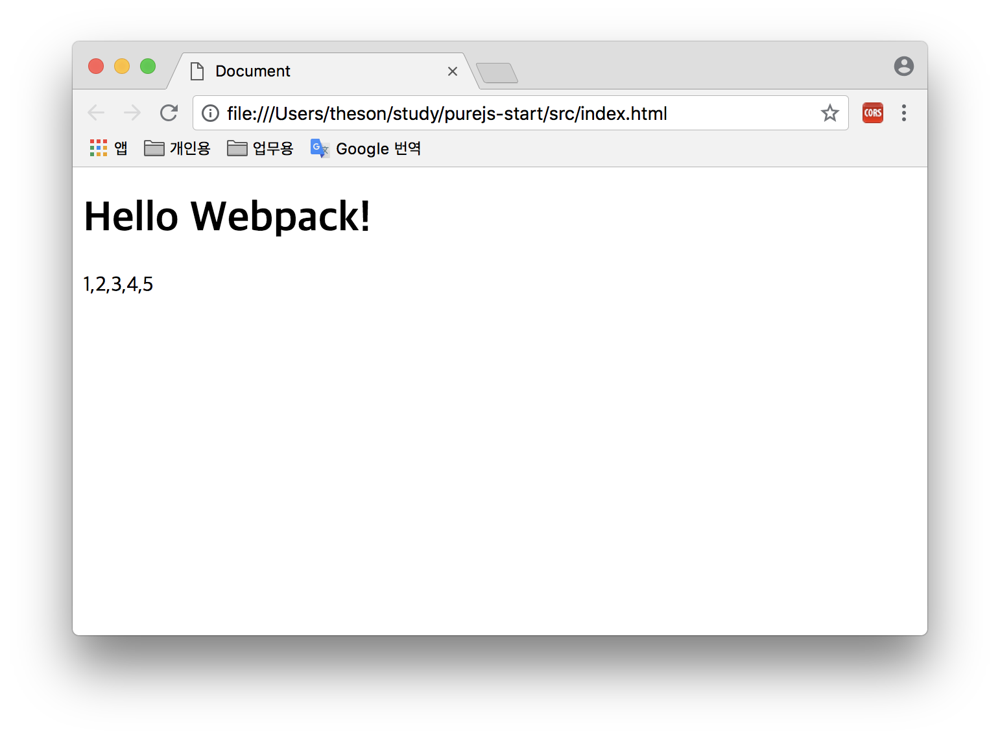
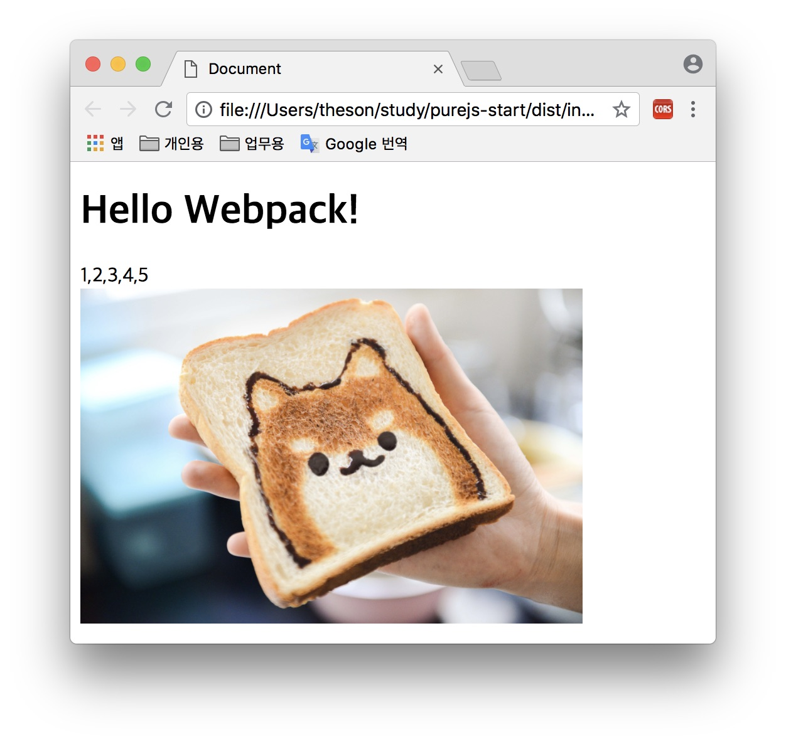

# webpack 기초 설정 도전기
## 개요
현재 프론트엔드 개발환경은 점점 Native Language 를 닮아가고 있습니다.  
그 이유를 나열 해 보자면,
* 최신 기술 및 언어 스펙을 적용하고자 함
  - 예: EcmaScript6, TypeScript
* 코드 모듈화
  - 예: CommonJS, ES6 Import
* 결과물에 대한 번들화
  - JS 및 CSS, Static Asset 등을 각각 하나로 만들고 요청횟수를 줄여서 서버/클라이언트의 퍼포먼스 향상

예전엔 webpack 과 browserify 양강 구도였으나 2018년 현재 기준으로 webpack 이 대세가 되었습니다.  
참고로 browserify 는 CommonJS를 사용하는 프론트엔드 모듈들을 하나로 **번들링 해 주는 기능만** 가지고 있습니다.  
그에 반해, webpack은 nodejs 기반으로 다양한 Loader와 Plugin을 활용하여 다양한 frontend build system을 구축할 수 있습니다.  
최근들어 많이 쓰이는 React, Angular, VueJS 등도 webpack 기반의 build system을 채용하고 있으며  
이들의 build system을 조금이라도 customizing 하려면 결국 webpack에 대한 학습이 필요하다는 결론에 도달 하게 되었습니다.

## 발단
사내에서 프론트엔드 업무를 진행하다보면, 단순한 페이지 하나에 JS 코드를 짜 넣는 경우가 종종 있습니다. (혹은 매우 많을 수도 있음)  
하지만 이런 단일 페이지들도 결국 각종 API와 Service, Provider, View, Controller 및 Component 등으로 각각 역할이 구분 되어질 수 있고, 또 그렇게 되어야 함을 알게 됩니다.  
한편, 많은 퍼블리셔들은 저 다양한 코드들을 단순히 jQuery를 이용하여 하나의 js 소스 내에 모두 작성하겠지만, 프론트엔드 직군은 본디 공학도로써, 저렇게 해서는 안된다는 것을 잘 알고 있습니다.  
하여, 이러한 Library 없는 순수한(Pure) JS 프로젝트에 쓰일 수 있는 템플릿 프로젝트를 webpack 으로 만들어 보기로 하였습니다.

## 목표
### 브라우저 환경
빌드 된 결과물이 구동되는 예상 환경을 미리 정해 둡니다.  
기준은 ES5를 정상적으로 지원하는지의 여부로 두었습니다. ([caniuse](https://caniuse.com/#search=es5) 참조)  
참고로 webpack은 기본적으로 IE8 이하는 지원하지 않습니다. (불가능 하진 않으나 이에 대한 처리는 예외로 남겨둠)
  - Desktop: IE10 이상, Edge, Chrome, FireFox, Safari
  - Android: Kitkat(4.4) 이상
  - iOS: 6.1 이상

### 기능
- ES6 문법 지원
- SASS Compiler
- 선택적 Polyfill: 모든 플리필을 가져오지 않고 필요한 것만 쓸 수 있도록 함.
- webpack-dev-server 를 이용한 HMR (Hot Module Replace) 적용: 소스 수정 후 바로바로 웹브라우저에 그 변경 내용을 확인할 수 있음.
- 가상 API 서버 구축: Backend API를 CORS (Cross Origin Resource Sharing) 문제로 수행 못 할 때 Proxy로 대신 수행 하거나 아직 Backend API 스펙은 나왔으나 개발이 안된 경우, 지속된 작업을 위한 보조 기능.

## 실습하기
### 초기세팅
이하 내용은 Mac OSX 내 vscode 를 사용할 때를 대상으로 작성 합니다.

프로젝트 폴더를 하나 만들고 그 곳에 터미널을 하나 열어 둡니다. 그리고 npm init 로 프로젝트 초기화를 수행 합니다. 여기서 프로젝트 이름은 purejs-start 로 하겠습니다.
```sh
$ mkdir purejs-start
$ cd purejs-start
$ npm init
```
그리고 프로젝트에 특별히 써 넣을게 없다면 엔터만 쳐서 모두 넘깁니다.

npm 초기화를 했으니 목표인 webpack을 설치 해 봅시다. 이 때, webpack을 이 후 build 시 cli 도구와 함께 써야 하므로 webpack-cli 도 함께 설치 합니다.
```sh
$ npm i -D webpack webpack-cli
```
간단하게 build 하는 것을 해 보기 위해 src 폴더 내에 아래와 같이 엔트리(entry) 가 될 app.js 를 만들고 import 해 볼 service.js 를 각각 파일을 만듭니다.  
그리고 이들을 수행 할 index.html 도 만듭시다.
```
- src
  - app.js
  - service.js
  - index.html
```
위 파일은 아래와 같이 간단하게 작성 합니다.
```js
// app.js
import service from './service.js'

const elmHead = document.querySelector('#head');
const elmApp = document.querySelector('#app');

elmHead.innerHTML = 'Hello Webpack!';

service.getList().then(data => elmApp.innerHTML = data.join(','));
```
```js
// service.js
export default {
  getList() {
    return Promise.resolve([
      1,2,3,4,5
    ]);
  }
};
```
```html
<!DOCTYPE html>
<html lang="en">
<head>
  <meta charset="UTF-8">
  <meta name="viewport" content="width=device-width, initial-scale=1.0">
  <meta http-equiv="X-UA-Compatible" content="ie=edge">
  <title>Document</title>
</head>
<body>
  <h1 id="head"></h1>
  <div id="app"></div>
</body>
</html>
```
이제 build를 해야 하는데 이 상태에선 webpack cli를 수행하면 수행되지 않을 것입니다.  
build를 수행하기 위한 별도의 명령어를 작성 해야 하는데, package.json 에 아래와 같이 작성 합니다.
```json
{
  "name": "purejs-start",
  "version": "1.0.0",
  "description": "",
  "main": "index.js",
  "scripts": {
    "build": "webpack",
    "test": "echo \"Error: no test specified\" && exit 1"
  },
  ...
}
```
그리고 프로젝트 루트(root)에 webpack.config.js 를 아래와 같이 만듭니다.
```js
module.exports = {
  entry: './src/app.js',
}
```
webpack.config.js 는 webpack 수행에 쓰이는 여러 설정(config) 내용이 정의된 파일 입니다.  
여기서 **entry**는 build할 때 기준이 되는 파일을 지정하는 것 입니다.

이제 수행을 합니다.
```sh
$ npm run build
```
그럼 아래와 같은 구조로 폴더와 파일이 생성 됩니다.
```
- dist
  - main.js
```
여기서 dist 는 build 된 파일이 들어가는 기본 폴더이며  
main.js 는 build된 js 코드 파일 입니다.  
여기서 __build__ 란 import 로 참조되는 모듈들을 모두 연결시켜 하나의 파일로 만들어주는 행위를 뜻합니다.  
이제 index.html 내의 body 태그 끝나는 부분 바로 윗쪽에 아래의 태그 내용을 추가 해 줍니다.
```html
<script src="../dist/main.js"></script>
```
index.html을 웹브라우저로 실행하면 아래와 같은 내용이 출력 될 것 입니다.


### html 파일을 dist 에 자동 복사
초기 세팅을 수행 해보면 불편한 점이 있습니다.  
바로 수행될 index.html 파일이 dist 폴더 안에 포함되지 않는다는 것 입니다.  
이렇게 되면 build 후 배포 할 때 매번 html 파일을 별도로 복사 해 줘야 하는 문제가 있습니다.  
이것을 고치기 위해선 plugin이 필요 합니다.  
아래와 같이 html-webpack-plugin 을 설치 합니다.
```sh
$ npm i -D html-webpack-plugin
```
그리고 webpack.config.js 을 다음과 같이 고쳐 줍니다.
```js
const HtmlWebpackPlugin = require('html-webpack-plugin');

module.exports = {
  entry: './src/app.js',
  plugins: [
    new HtmlWebpackPlugin({
      filename: 'index.html',
      template: './src/index.html',
      inject: true,
    }),
  ]
}
```
이제 index.html 내에 script 태그는 필요 없으니 제거 합니다.  
그리고 build 명령어를 수행 합니다.  
이전과는 달리 index.html 파일이 dist 안에 포함되고 파일 내에 자동으로 번들 스크립트를 script 태그를 삽입 하는 것을 볼 수 있습니다.  
해당 기능을 하는 옵션은 __inject: true__ 라는 부분 입니다. 즉, 번들링된 소스 파일을 html 내에 자동으로 삽입 하느냐의 여부 인 것 입니다.  
dist 내 index.html 을 수행 하면 역시 이전과 동일한 결과가 출력됨을 확인 할 수 있습니다.

### 정적 파일 복사
그럼 웹 프로젝트 내 이미지나 웹폰트 등을 포함할 때는 어떻게 해야 할까요.  
단순히 복사만 하면 된다면 copy-webpack-plugin 을 이용하면 됩니다.  
아래와 같이 설치 합니다.
```sh
$ npm i -D copy-webpack-plugin
```
그리고 webpack.config.js 파일 내용을 아래와 같이 바꿔 줍니다.
```js
const HtmlWebpackPlugin = require('html-webpack-plugin');
const CopyWebpackPlugin = require('copy-webpack-plugin');
const path = require('path');

module.exports = {
  entry: './src/app.js',
  plugins: [
    new HtmlWebpackPlugin({
      filename: 'index.html',
      template: './src/index.html',
      inject: true,
    }),
    new CopyWebpackPlugin([
      {
        from: path.resolve(__dirname, 'static'),
        to: 'static',
        ignore: ['^.*']
      }
    ]),
  ]
}
```
추가된 CopyWebpackPlugin 의 옵션을 보자면,
- from: 복사 할 원본. 절대경로로 넣기 위해 path.resolve 를 사용 했습니다.
- to: 복사 될 폴더명. 복사된 내용을 담을 폴더명 입니다. dist 폴더 내에 자동 삽입 됩니다.
- ignore: .(점, dot) 으로 시작되는 파일들이 주로 .gitignore 같이 프로젝트 설정 관련 파일이라 붙여 주었습니다. static 폴더 안에 이런게 들어갈 일이 전혀 없다면 지워도 상관 없습니다.

프로젝트 루트에 static 폴더를 만들고 그 안에 사진을 하나 넣습니다. 사진 파일과 그 파일명은 아무거나 좋습니다.
```
- static
  - dog-bread.jpg
```
저 내용을 index.html 에 포함 시키겠습니다.  
참고로 static 폴더의 내용이 dist 에 포함 될 때, static 폴더 채로 그대로 복사 된다 보시면 됩니다.  
즉, build 하면 아래와 같은 구조가 됩니다.
```
- dist
  - index.html
  - main.js
  - static
    - dog-bread.jpg
```
따라서, index.html 에 작성한다면, static 폴더 내 이미지를 가리키도록 해야 합니다.  
아래는 html 파일 내 추가 될 태그 내용 입니다. 사이즈가 커서 400 픽셀로 제한 했습니다.
```html

```
build 를 수행하고 dist 내 index.html 을 수행하면 다음과 같은 화면이 출력 됩니다.


## 로더 적용
웹팩에서 로더란 일종의 해석기 역할을 합니다.  
현재까진 기본 ES6 코드들을 단순히 번들링 하는 것으로 그쳤지만, 이를 모든 웹브라우저 환경에서 구동될 순 없으므로 이 코드를 ES5 코드로 변환하는 과정을 거쳐야 합니다.  
이런 기능을 가진 외부 프로그램들을 가리켜 트랜스파일러(Transpiler) 라고 합니다.

### Transpiler
트랜스파일러란 같은 언어 내에서 좀 더 보편적으로 쓰일 수 있는 방법으로 변환(Transpile) 해 주는 도구 이며,
실행활을 예로 들자면 똑같은 한국어에서 경상도 방언을 좀 더 알아듣기 쉬운 표준어로 바꾸는 것과 유사 합니다.  
현재 프론트엔드 영역에서는 ES6, TypeScript, CoffeeScript, Dart 같은 JS 에서 좀 더 확장된 별도의 언어에서 부터  
React 의 JSX, VueJS의 Vue Template, Angular Template 같은, 유사 HTML 템플릿을 순수 JS 코드로 변환 하는 것 까지 매우 다양합니다.  
여기서는 그 중 바벨(Babel)에 대해서만 서술하고 적용 시켜 보겠습니다.

### Babel

바벨은 ES6 문법 내용을 ES5로 쓸 수 있게 만들어주는 Transpiler 입니다.  
바벨을 이용 시 ES6를 제대로 지원 못하는 하위 Legacy Web Browser 들, 예를 들면 안드로이드 킷캣(4.4)의 기본 브라우저 같은 환경에서도 ES6 결과물을 구동 시킬 수 있습니다.  
다만 자체적인 ES6를 대체할 코드를 삽입 하기 때문에 build 후 그 결과물 소스코드 용량이 다소 증가된다는 단점이 있습니다.  
이는 후술할 uglify 같은 minify 도구를 이용하여 어느정도 해소할 수 있습니다.

### Babel Loader
바벨은 그 자체로만 쓰는 경우는 거의 없으며 웹팩같은 번들러와 함께 사용되는 것이 보편적 입니다.  
웹팩에서 이런 해석기가 쓰이려면 로더(Loader)라는 일종의 플러그인 형태로 제공 되어야 합니다.  
바벨은 바벨로더가 마련되어 있기에 이를 웹팩에 곧바로 적용하여 사용할 수 있습니다.  
바벨과 바벨 로더를 설치 합니다.
```sh
$ npm i -D @babel/core @babel/preset-env babel-loader
```
설치되는 내용들에 대한 설명 입니다.
- @babel/core: 바벨 해석기의 핵심(core) 기능 입니다.
- @babel/preset-env: es6를 es5로 바꾸기위한 기본 설정 환경을 담고 있습니다;.
- babel-loader: 웹팩에서 바벨을 쓸 수 있게 해주는 로더 입니다.

webpack.config.js 에 아래 내용을 추가 해 줍니다.
```js
const HtmlWebpackPlugin = require('html-webpack-plugin');
const CopyWebpackPlugin = require('copy-webpack-plugin');
const path = require('path');

module.exports = {
  entry: './src/app.js',
  plugins: [
    ...
  ],
  module: {
    rules: [
      {
        test: /\.js$/,
        exclude: /(node_modules)/,
        use: {
          loader: 'babel-loader',
          options: {
            cacheDirectory: true,
            presets: [
              "@babel/preset-env"
            ],
          }
        }
      },
    ]
  }
}
```
위와 같이 module 내 rules 를 채워 넣는 것으로 로더 설정을 할 수 있습니다.  
각 항목별 부연 설명을 하자면
- test: 바벨을 적용 할 파일명의 패턴 입니다. 정규식(Regular Expression)으로 작성 합니다.
- exclude: 바벨이 작업할 때 제외 할 폴더/파일명 입니다. 역시 정규식으로 작성 합니다.
- use: 현재 규칙 패턴에 적용 할 로더 정보가 들어 갑니다.
  - loader: 사용 할 로더 이름. 보통 npm 으로 설치 했던 패키지명이 쓰입니다.
  - options: 로더 수행 시 필요한 옵션을 설정 합니다.
    - cacheDirectory: 빌드 할 때 별도 캐시를 두어 빌드 속도를 향상 시킵니다. true 로 하면 적용.
    - presets: 바벨이 컴파일 할 때 참조 할 언어적 환경을 설정 합니다. 여기서 @babel/preset-env 는 ES6 환경이나 구동 될 웹브라우저 타겟등을 다양하게 설정 할 수 있는 프리셋이며, ES6의 최신 스펙을 지원하기 위해 적용 하는 것 입니다.

이제 build 를 수행하고 main.js 를 열어보면, es6 문법인 const 가 var 로 바뀌어 있음을 확인할 수 있습니다.

### CSS Pre-processor
CSS는 HTML 웹페이지에서 각종 디자인을 입히는 용도로 쓰여 오고 있습니다.  
하지만 CSS 자체로는 모듈 관리나 반복되는 스타일링, 자주 사용되는 색상값과 사이즈 등을 공통으로 사용하는 기능 자체가 전무 했기 때문에 고전적인 방식으론, 여러개의 css 파일을 두어 각 페이지 및 컴포넌트별 스타일 할당을 해 두는게 전부였습니다.  
이에 대한 대안으로 나온 것이 CSS 전처리기 이며, CSS의 확장된 기능을 지원하는 특정 언어를 컴파일 하여 일반적인 CSS로 만드는 방법 입니다.  
즉, 개념상으론 위에서 언급한 트랜스파일러와 거의 유사하지만, 목표 언어가 JS 가 아닌 CSS 라는 점이 다를 뿐입니다.

### SASS
  
SASS 는 LESS 와 함께 보편적으로 많이 쓰이는 CSS 전처리기 입니다.  
쓰이는 언어로는 전처리기 명칭과 동일한 SASS 와 함께 CSS 문법과 매우 유사한 SCSS 2가지를 지원하며,
현재 기준으로 SCSS 가 CSS와 문법이 유사한 관계로 보다 많이 쓰이고 있습니다.  

### Sass Loader
웹팩에서 SASS 컴파일 할 때는 sass-loader 를 이용 합니다.  
sass-loader 를 통해 css 로 만들면, 이를 웹팩에서 다시 이용할 수 있어야 하기 때문에 css-loader가 별도로 필요 합니다.
또한 웹팩은 번들러 이기 때문에 css 내용을 js 안에 포함 시키므로, 별도로 css로 빌드된 스타일 시트 파일이 필요하다면 파일 추출기 역시 필요 합니다.
```sh
$ npm i -D node-sass sass-loader css-loader mini-css-extract-plugin
```
부연 설명
- node-sass: nodejs 기반으로 수행 할 수 있는 SASS 입니다.
- sass-loader: 웹팩에서 scss 파일을 불러올 수 있게 합니다.
- css-loader: scss 가 css로 컴파일 된 후 웹팩에서 불러올 수 있게 합니다.
- mini-css-extract-plugin: css 내용을 별도 파일로 저장 할 수 있게 합니다.