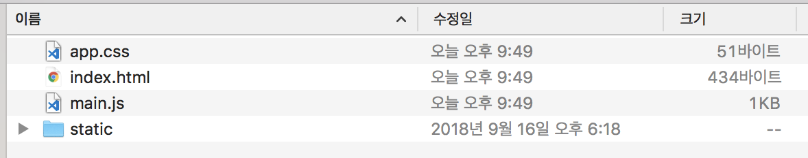
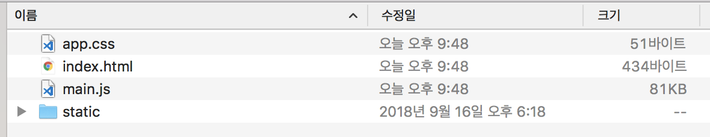
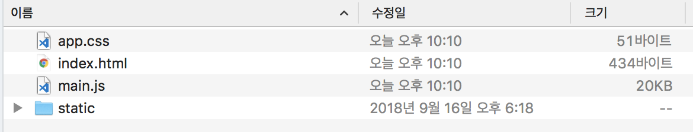

# webpack 기초 설정 도전기 - 2편
지난번엔 아래와 같은 내용을 작성 해 보았습니다.
- 프로젝트 기초 파일 작성
- html 파일을 dist 에 자동 복사
- 정적 파일 복사
- Babel 적용
- SASS 적용

그럼 지난번에 이이서 작성 해 보도록 합니다.

## 실습하기

### Polyfill 적용
js는 브라우저 환경에 따라 지원되는 각종 객체 및 메서드에 차이가 있습니다.
최신 브라우저에서는 최신 스펙을 늘 쓸 수 있겠으나,
아쉽게도 사용자는 늘 최신의 환경에서 웹을 사용하진 않습니다.  
이러한 구(old) 환경에서 최신 스펙을 사용할 수 있게 해 주는 모듈들을 통틀어 폴리필(polyfill)이라 합니다.

#### babel polyfill
바벨(Babel) 에서는 자체적으로 babel-polyfill 이라는 모듈을 지원하고 있고,
이용하는 프로젝트에서 단순히 import 함으로써 간단하게 쓸 수 있습니다.

babel-polyfill을 설치하고 설정 합니다.
```sh
$ npm i -S @babel/polyfill
```
```js
// webpack.config.js
module.exports = {
  entry: ['./src/polyfills.js', './src/app.js', './src/style/app.scss'],
  module: {
    ...
  },
  ...
};
```
```js
// ./src/polyfills.js
import '@babel/polyfill';
```
무척 간단합니다.
이제 build 하면 폴리필이 포함되어 파일이 만들어질 것 입니다.

#### 폴리필의 단점
이제 ES5를 정상적으로 지원하는 모든 브라우저에선 JS 최신 스펙을 사용할 수 있도록 만들었습니다.  
하지만 폴리필은 단점이 있는데, 바로 **번들파일 용량이 커진다**는 것입니다.  
당연합니다. 웹브라우저가 네이티브로 지원못하는 기능을 js 코드로써 추가로 끼워 넣어야 하니 말이죠.  


  번들 용량이 무려 80KB나 늘어난 것을 확인할 수 있습니다.

그래도 폴리필 없이는 소스코드를 미려하게 작성하기가 어렵습니다. 비표준 함수가 만들어질 수도 있고, 이 것은 때때로 프로젝트로 협업 할 때 중복된 코드나 그에 따른 혼란을 야기 시킬 수 있습니다.
여러가지로 고민하다 필요한 것만 추려서 넣는 쪽으로 방향을 바꿔 보았습니다.

#### core-js 적용
babel polyfill은 일종의 polyfill 모음집인 core-js 내용을 기반으로 제공되고 있습니다.
바벨 폴리필을 직접적으로 사용하면 모든 폴리필이 적용되니, core-js로 대신 하되, 필요한 내용만 선택적으로 적용 해 보겠습니다.

core-js 를 별도로 설치하고 기존 polyfills.js 내용을 바꿔 줍니다.
```sh
$ npm i -S core-js
```
```js
// polyfills.js
import 'core-js/es6/promise';
import 'core-js/fn/object/assign';
import 'core-js/fn/string/starts-with';
```
제가 개인적으로 자주 쓰는 폴리필중 3가지 정도 추려서 넣어 보았습니다.
- Promise
- Object.assign
- String.prototype.startsWith

build 해 봅니다.

기존 대비해서 용량이 20KB 로 줄었음을 확인할 수 있습니다.

다소 번거로울 수 있으나, 개발 특성상 항상 쓰이는 것이 전체 내용에 비해 소수이므로, 필요할 때마다 저렇게 폴리필을 추가 하는 것이 좀 더 사용자 및 서버 입장에서 보다 경제적 입니다.

### 로컬 개발 서버 구축
js 와 css 모듈 번들링 및 정적 파일 복사 까지,
purejs 로 프로젝트를 구성할 수 있는 기본적인 준비가 다 되었습니다.

하지만 이대로라면, 빌드된 파일을 일일이 FTP 등을 이용하여 서버에 올려가며 테스트 해야 합니다.  
이런 불편함을 막고자, 로컬 개발 서버를 구축하여 좀 더 편한 개발 환경을 만들어 볼 차례 입니다.

#### webpack-dev-server
웹팩은 자체적으로 개발서버를 구동할 수 있도록 Addon 형식으로써 공식 지원하고 있습니다.  
webpack-dev-server 라 불리우는 프로그램인데, 로컬 환경에 특정 포트(port)를 지정하여 nodejs 환경에서 웹 가상 서버를 만들어 줍니다.  
설치 하고 설정해 보겠습니다.
```sh
$ npm i -D webpack-dev-server
```
```js
// webpack.config.js
module.exports = {
  entry: ['./src/polyfills.js', './src/app.js', './src/style/app.scss'],
  module: {
    ...
  },
  plugins: [
    ...
  ],
  devServer: {
    contentBase: './src',
    port: 8080,
  },
}
```
서버 설정 내용은 다음과 같습니다.
- contentBase: 서버 구동 시 기본이 되는 폴더를 설정. 이 곳의 내용을 web root 로 가정하여 구동 된다.
- port: 로컬 서버의 수행 포트

프로젝트의 소스가 모두 src 폴더안에 있으므로 contentBase 에 이 경로로 지정 했습니다.  
포트는 8080 으로 하였습니다.

이제 서버를 구동시키는 스크립트 명령어를 package.json에 추가 합니다.
```js
// package.json
{
  "name": "purejs-start",
  "version": "1.0.0",
  "description": "purejs",
  "main": "src/index.js",
  "scripts": {
    "start": "webpack-dev-server",
    "build": "webpack",
    "test": "echo \"Error: no test specified\" && exit 1"
  },
  ...
}
```
위와 같이 start 명령어를 추가하고 실행 합니다.
```sh
$ npm start
```
이제 http://localhost:8080 으로 수행 하면 이전에 진행했던 index.html 이 그대로 수행됨을 확인할 수 있습니다.

#### 개발 내용 실시간 반영 하기
로컬 테스트 서버를 구동 시켰습니다.  
그런데 불편한 점이 있습니다.  
소스를 수정하고 그 내용을 확인하고 싶으면 매번 웹브라우저로 이동하여 새로고침 해 주어야 합니다.  
이런 불편함을 개선 하는 기능을 알아보고 적용 해 봅시다.

#### Hot Module Replace
줄여서 HMR 이라 불리는데, 로컬 테스트용 웹서버를 구동 시키고, 통합개발환경(IDE)이나 각종 에디터를 통해 소스가 수정되면 곧바로 로컬호스트로 수행중인 해당 웹브라우저에 통보하여 그 변경사항이 즉각 반영되도록 하는 기술들을 총칭 합니다.  
즉, 이전처럼 소스 수정 후 새로고침(Refresh)을 할 필요 없어지게 되는 셈 입니다!  
물론 React, Angular, VueJS 같은 프레임워크를 이용한 개발 단계에서도 HMR을 적극 채용하고 있습니다.

#### 웹팩에 HMR 적용 하기
기존 webpack.config.js 파일에 몇가지 코드만 덧붙이면 매우 간단하게 HMR 기능을 사용할 수 있습니다.  
아래와 같이 설정 파일에 코드를 추가 해 줍니다.
```js
// webpack.config.js
const webpack = require('webpack');
// ...

module.exports = {
  entry: ['./src/polyfills.js', './src/app.js', './src/style/app.scss'],
  module: {
    ...
  },
  plugins: [
    ...
    new webpack.HotModuleReplacementPlugin(),
  ],
  devServer: {
    contentBase: './src',
    port: 8080,
    watchContentBase: true,
    hot: true,
  },
}
```
추가 된 부분은 webpack 모듈을 가져오는 부분과 HotModuleReplacementPlugin 을 플러그인에 적용하는 부분, 그리고 devServer 에 watchContentBase 및 hot 항목을 추가, 이렇게 4가지 입니다.  
웹팩에서 HMR 을 쓰려면 저 4가지 코드는 항상 필수라 보시면 됩니다.

다시 npm start 수행 하여 개발 서버를 구동 시키고 http://localhost:8080 으로 접속 합니다.
그리고 app.js 나 다른 js 소스들을 수정하여 봅시다.  
실시간으로 웹브라우저에 반영됨을 확인할 수 있을 것입니다.

### 가상 API 서버 구축
이제 마지막 단계 입니다. 바로 백엔드 API 서버를 만들어 보는 것 입니다.  
물론 이 내용은 백엔드 파트와 협업한다는 가정하에 만들어지는 것이므로, 구축된 가상 API 서버를 실서버에 직접 사용하는 일은 없습니다.  
하지만 아래같은 상황에 유연하게 대처할 수 있기에 개발 테스트 과정에서 사용 됩니다.
- 백엔드 API 개발이 다 이뤄지지 못하였다.
- 프로젝트 일정상, 백엔드 개발 일정을 기다릴 수 없다.
- 백엔드 API에 대하여 여러가지 시나리오적 테스트를 담당자 도움 없이 해야 한다.
- 보안 관계상, CORS 문제로 로컬 테스트 시 Proxy를 써야 한다.

#### express
현재 실습 단계에선 nodejs를 기반으로 동작되고 있으며, node 에서 쓰이는 웹프레임워크로는 대표적으로 express가 있습니다.  
express 를 이용하면, 어렵지 않게 RESTful Web API를 만들 수 있습니다.

#### 웹서버 구동환경 작성
먼저 express 서버에 필요한 패키지를 dev dependency로 설치합니다.
그리고 서버 전용 코드만을 따로 두는 server 폴더를 프로젝트 루트에 생성한 뒤
index.js 를 아래와 같이 작성 합니다.

```sh
$ npm i -D express body-parser
```
body-parser 는 RESTful로 웹을 이용할 때 POST, PUT 같은 메서드로 자료를 넘길 시 그 내용을 js 내에서 곧바로 쓸 수 있게 해주는 미들웨어(middleware) 입니다.
```js
// ./server/index.js
const express = require('express');
const app = express();
const bodyParser = require('body-parser');
const PORT = 8081;

app.use(bodyParser.urlencoded({ extended: false }));
app.use(bodyParser.json());

app.get('/list', (req, res) => {
  res.json({
    items: [
      10, 11, 12, 13, 14
    ],
  });
});

app.listen(PORT, () => {
  console.log('api virtual server ' + PORT + ' start~!');
});
```
express 를 구동시키기 위한 최소한의 코드로 작성 해 보았습니다.

서버를 구동시켜 보겠습니다.
```sh
$ node ./server
```
그리고 http://localhost:8081/list 로 접속 합니다.
json 형태의 문자열이 나올 것입니다.
이제 기존 service 코드를 바꾸어 저 api 를 대신 호출 하도록 바꿔 보겠습니다.
```js
// service.js
const apiBase = {
  get(url) {
    return new Promise((resolve, reject) => {
      const xhr = new XMLHttpRequest();

      xhr.open('GET', url, true);
      xhr.onreadystatechange = function(evt) {
        const status = xhr.status;
        const resText = xhr.responseText;

        if (xhr.readyState == 4) {
          if ((status >= 200) && (status < 400)) {
            resolve(JSON.parse(resText));
          }
          else if (status >= 400 && status < 500 ) {
            reject(JSON.parse(resText));
          } else {
            reject(evt, xhr);
          }
        }
      };

      xhr.send(url);
    })
    
  }
}

export default {
  getList() {
    return apiBase.get('http://localhost:8081/list')
      .then(res => res.items);
  }
};
```
만들어진 기본 api 서비스 객체를 바탕으로 url만 넘겨서 재사용토록 하는, 일종의 Composit Pattern을 응용한 코드 입니다.  
실제론 http 메서드 형식마다 별도로 기능을 구현해야 하나, GET 외 나머지는 생략 하였습니다.

이제 npm start 와 node ./server 를 각각 별도로 구동하여 두 서버를 동시에 구동 시켜 봅시다.  
근데 두 서버를 하나의 명령어, 예컨데 npm start 하나로 둘 다 구동시킬 순 없을까요?

#### 